<h1>Friendly Fitness</h1>

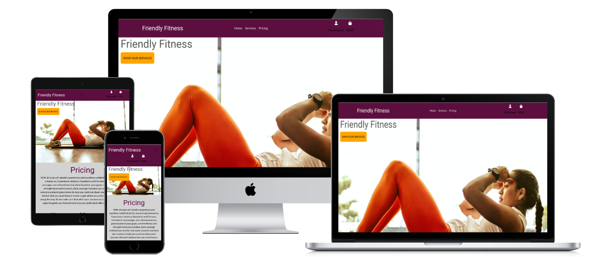

### **Live Site**
[Frinedly Fitness Live Site](https://friendly-fitness.herokuapp.com/)

### **Repository:**
[Friendly Fitness Github Repository](https://github.com/StephenKennyGains/FriendlyFitness)

# About
An E-commerce site for selling Personal Training services for those working in the fitness industry selling One to One personal Training and Online Coaching Services.

# Table of Contents

[User Experience](#user-experience)

- [Marketing Audience](#marketing-audience)

- [User Stories](#user-stories)

- [Features](#features)

- [Structure](#structure)
    - [Databases](#databases)
    - [Wireframes](#wireframes)

[Marketing Strategy](#marketing-strategy)

[Features](#features)

[Additional Future Features](#additional-future-features)

[Technologies Used](#technologies-used)

[User Testing](#user-testing)

[Validator Testing](#validator-testing)

[Responsive Testing](#responsive-testing)

[Known Bugs](#known-bugs)

[User Feedback](#user-feedback)

[Search Engine Optimisation](#search-engine-optimisation)

[Deployment](#deployment)

[Credits](#credits)

[Project Requirements](#project-requirements)

[Acknowledgements](#Acknowledgements)

# User Experience

# Marketing Audience

This website was built based on my own experiences from 10 years working in the fitness industry modelled as a B2C structure. The aim of the site is to allow a Personal Trainer to advertise, market and sell their Personal Training services for both in Person and Online training. 

From experience in the industry, many trainers will work as independant contractors to the gym in which they operate or operate their business by going to people's homes, public training spaces or through online services. With that in mind, selling, advertising and maing their services accesible is a challenge to those in the industry who are in heavy competition to have a larger brand reach and ease of access to their services.

For selling services such as Personal Training, the target adience can be quite broad as it caters to both a male and female demographic along with a wide age range anywhere from 18-50 for online services. With the broad age range, the site needed to be both visually appealing, high speed and a very simplistic navigation and ease of use for the older demographic. Given the broad age range, the site also needs to be as visually appealing in mobile and tablet views.

The general target of advertising personal training would be for 35-50 as the ideal target market given the higher likelihood of being able to afford the services, have the scheduling time for avialing of them and the higher need for more tailored advice for health reasons and the overall impacts of age. With the high trend rates of gym, fitness and personal training related content, the market has expanded to the younger demographic and with that, the imagery, fonts and colour scheme is intended to be both appealing to navigate the site for older users and be visually appealing to younger users.

# User Stories

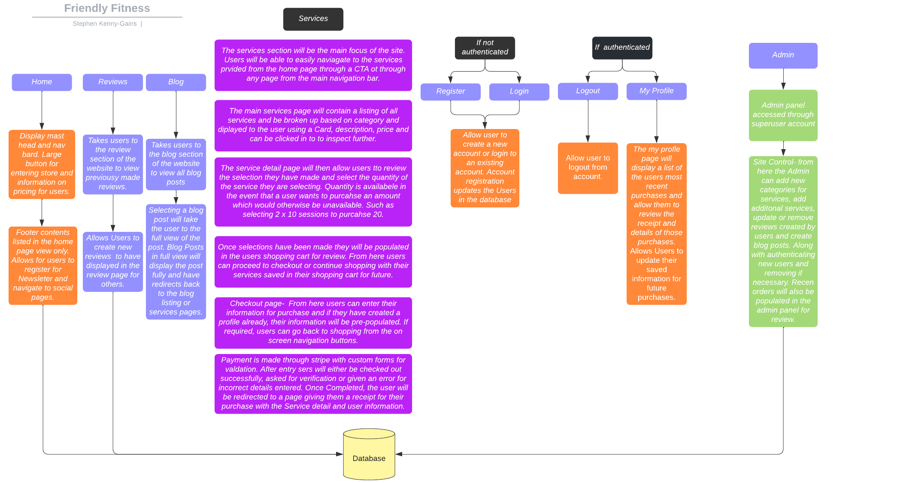

The User stories for the project can be found in the following link which leads to my gitHub Project associated to this app. -[here](https://github.com/users/StephenKennyGains/projects/2).

# Features

To ensure the project User Stories were completed and met, the site required the following:

- Site Navigation which was simple and minimal for quick and easy navigation

- A landing page which outlined the Pricing and allowed easy access to site services

- A services page which was user friendly, easy to access, easy to use and visually appealing

- Service images, descriptions, pricing, and easy selection of

- A cart page which allows users to store services in their account while they continue to browse

- A checkout page so that users can review their information and the services they are purchasing

- A confirmation page for reviewing their purchase

- Login, registration, account and confirmation pages for account creation

- Custom 404 Error Page

# Structure

The site is strctrure in a simple and effective way leaving very mimimal choice to steer users directly to the services section of the page and 

The option is open for both users and non-users to purchase from the site to leave open access to all users

The website is made of the following apps:
1. Home
2. Serices
3. Profile
4. Cart
5. Checkout

## Databases

For the live site, I connected Heroku's Postgres Database and for the local environment, it remains connected to Sqlite.
Below is the entity ralationship diagram of the site:

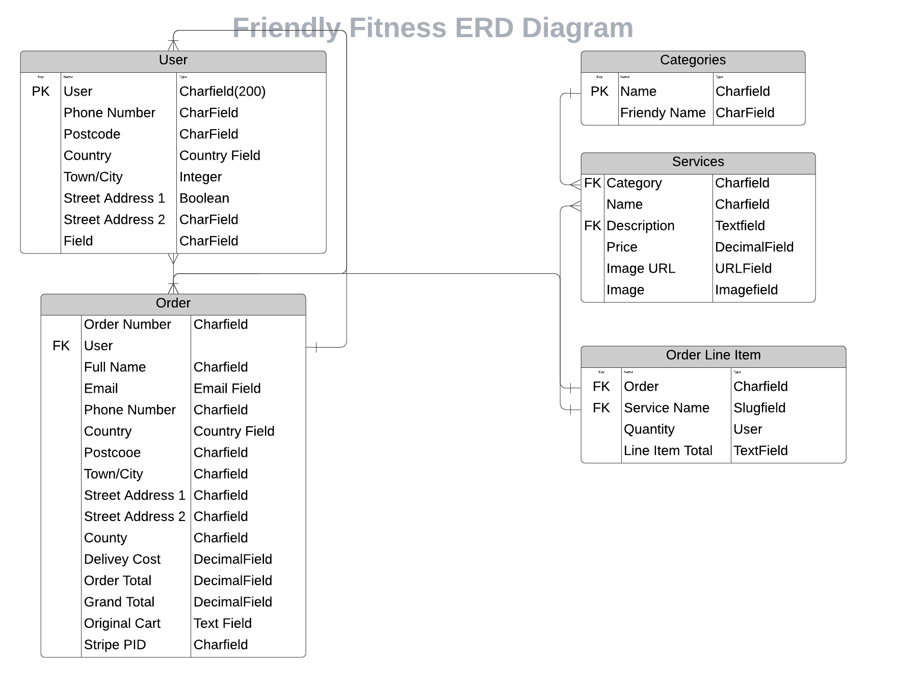

### Category

The Category is the options for the User and Admin to select Services in a filtered way. Admins can add and update categories through the admin panel and Users will be filtered services based by category. The category option does not require many fileds but is made useful for the display desired for the site. Without the category, the options for filtering services would require more lines of code and would need to be constanty updated when aspects such as a new naming convention are added and could lead to the services displaying in an incorrect order.

### Services
Services can be added by the admin from both the site and admin panel along with updating and deleting. Services can be selected by the user to add to their cart. The service model was kept to be only what was required whilst still allowing a little bit of scope for future development. Whilst aspects like SKU were not needed, other aspects which may not be exactly required, will be at a later point if the services and product categories are expanded at a later point. 

### Order & Order Line Items
Order Line Items are created by the User by adding the service to their Cart. Their Order is based on the total services along with their User and purchase information. Order and Order Line Items follow a similar flow in the choices made and that is that whilst not all aspects are 100% crucial for the line item and order to be created and managed in the database, they offer no downside from being present and will make it easier to add additiona features at a later point.

### User
User profiles are created by the user for speed in purchasing services. Users can save their details and Login to use those details in future purchases. Being based in Ireland, the County field offers a valid entry. Initially the plan was to limit the fields to only accept specific criteria for the country and county as this service would only be offered to customers in a local area to the site owner. with the addition of online training services, this would have been redundant and so were kept the same as they currently stand. 
 

## Wireframes

Wireframes were created on Adobe XD and have been updated after initial views in the live environment. The dark grey background and yellow font colours didn't seem to contrast with one another as effectively as originally anitcipated and so were replaced by the colour palettes in the areas below. Use the drop down below to see the wireframes and orignal state.

  
Screenshots Desktop

  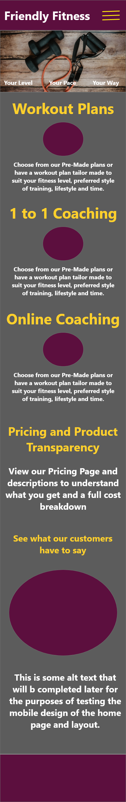

  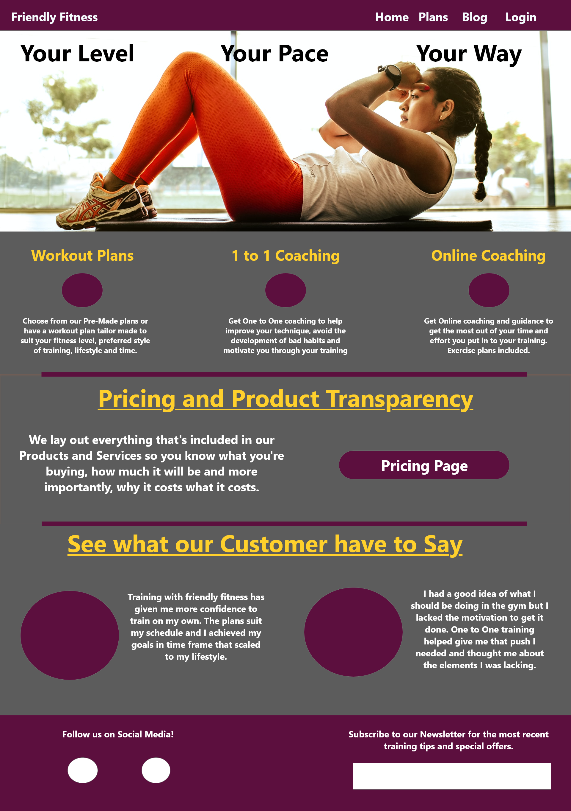

  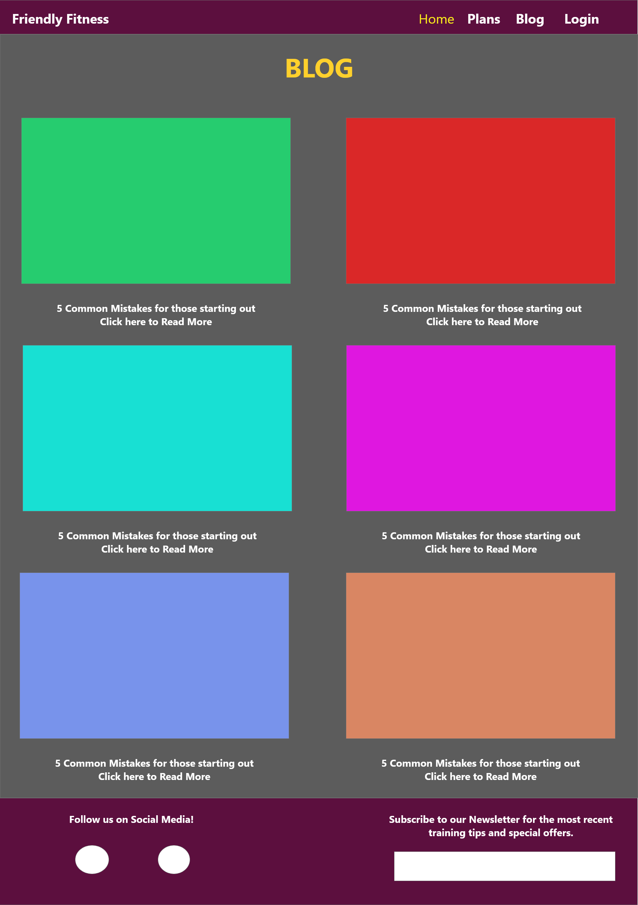

  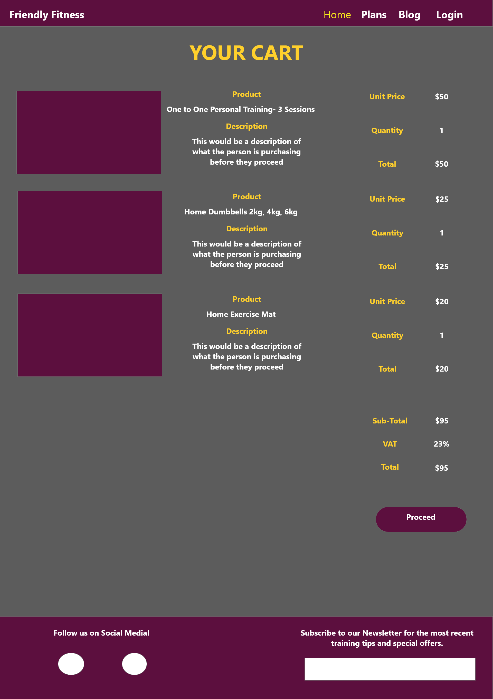

  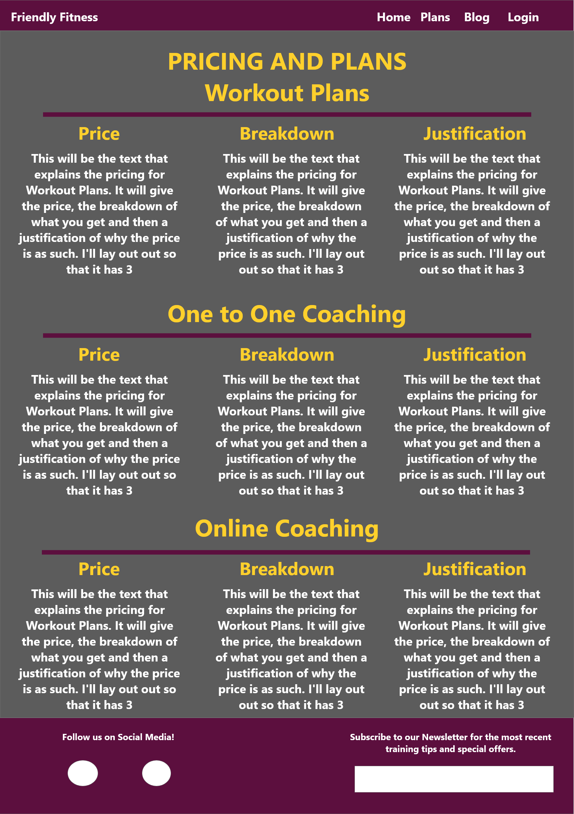

 

# Marketing Strategy

For the Marketing of the website I want to be able to reach both ends of the spectrum for the target audience and be able to cater towards all genders and the various personality types of potential clients. with the age gap between the newer demographic of younger people and the tragte demogrpahic of older people, Facebook and Intagram are the 2 platforms of choice to market through alongside email marketing. While Tiktok is the largest growing audience and highest growing spend rate amongst marketers, the saturation of low quality content may be conflicting for the type of training aimed at being provided. 

Tiktok although it has a large audience and is a huge growing market and is now becoming the leading social media platform, it stil has a younger target audience and content quality on the platorm in the Fitness and training space can be low so it was ruled out as Facebook and Instram can be targetted on One post and thus saves time in marketing towards multiple channels which cannot yet be managed.

To combine the aim of Facebook, Instagram and Email Marketing, a platform like HubSpot with a starter marketing plan and CRM plan would allow for large scale MArketing campaigns, social media posting, traffic analytics for the site using their HuBSpot Tracking code and scheduling and managing posts in one system. Along with that, User purchases and plans could be tracked and invoiced from the same system, alongside multiple integrations available. This would be my go to for Marketing and would allow for a smaller based team such as a One man Peronal Training business to still operate effectively and effeciently. 

### MailChimp

Users can currently subscribe to the Newsletter through the Mailchimp form in the footer of the site but this would also be able to managed through HubSpot if the Marketing and Social content was migrated there.

### Facebook

Whilst I do not currently have any social media apps to apply a Facebook or other Social Media Business page. Below you find a Facebook Mockup site for proposed advertising. The content strategy with Facebook advertsing would be to use a Free information model using imagery and text wich aligns with the site content to breed familiarity and trust between the User, the Content they are provided with and the Site Contents and Services.

# Features

## Homepage

 

  
Screenshots Desktop

  

  - The header was kept as minimal as possible and I chose to keep the services section without any drop downs as the low amount of services currently being offered meant it was un necessary to do additional steps for navigation

  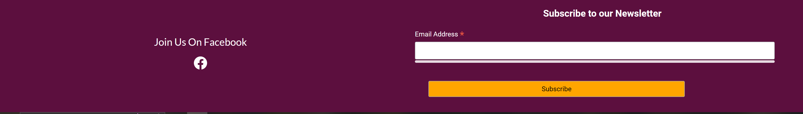

  - I chose to keep the footer only to the Home page as it felt intrusive on other pages and could potentially lead customers away from their main aim of the site which is to purchase personal training sessions. For that reason I kept navigation away for the site to a minimum.

  

  - I wanted to main website image to be something both striking and also which easily gave the viewer a snapshot of the site aim. I chose the image I chose because it tailors to a wider audience as is in the Marketing startegy. 

  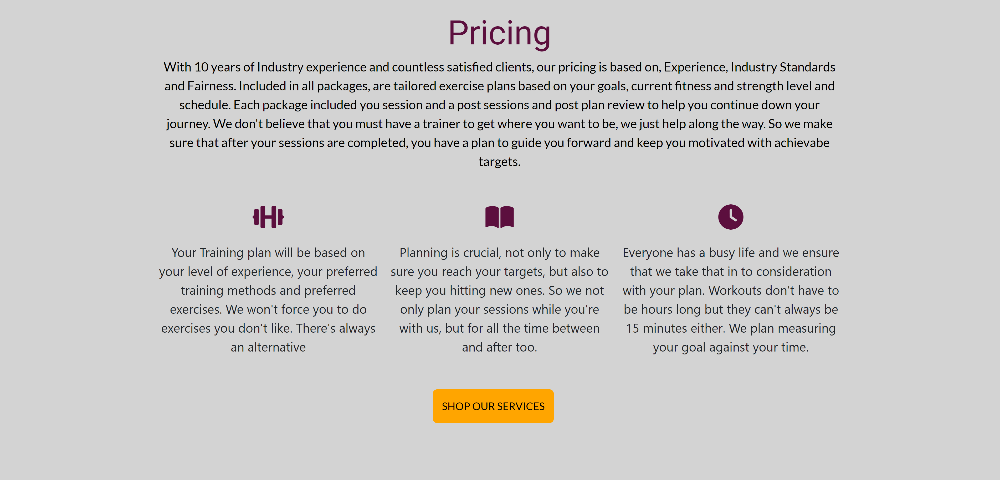

  - The pricing section was added to give a bit of authenticity and personality to the site. Letting customers see a justification of the services pricing before purchasing for those who would not already be familiar to the trainer they are about to work with.

  

  - The services page was kept to the same level of mimimal design as the home. Providing only the necessary details of the service and choosing imagery which spoke to a wide audience. I choose to categorize and order the services and left room for additional services without the page being excessively long. Any more than 3 services and I would then choose to break down the service section and add the additonal required navigation through the site.

  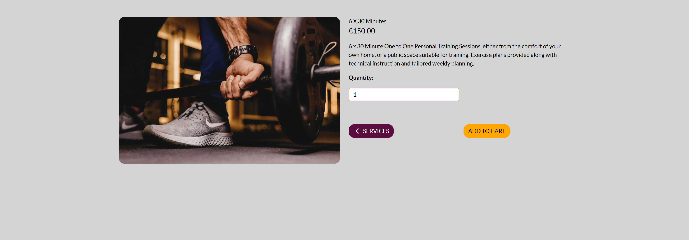

  - For the service detail, I experimented with the footer also being present here but after user feedback, they felt there was very little to get confused about on this page and made for a more likely addition to the shopping cart. They felt the layout was clean and easy to read and felt the flow was laid out nicely.

  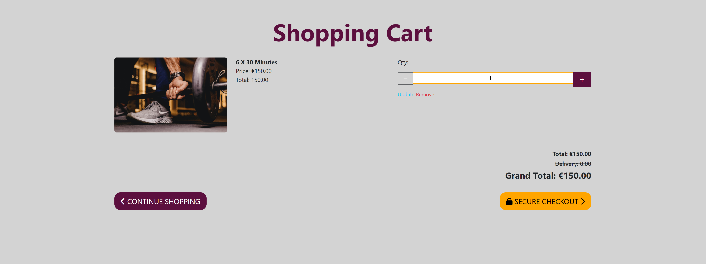

  - The shopping cartm while having the update and delete functionality, still does not feel over bearing to the user and I wanted to appearance to look and feel familiar to the previous pages bu while also being ditinct enough to know that you are nearing the final stage of completing your purchase.

  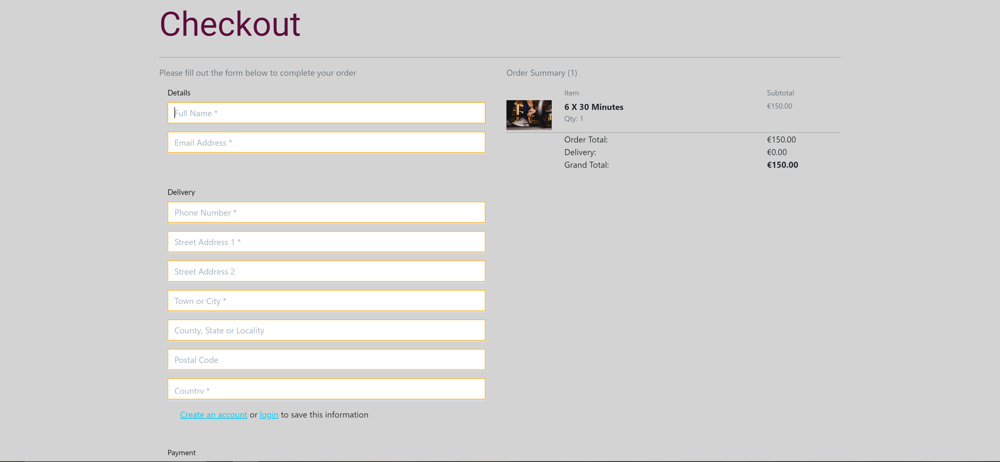

  - The checkout, while having a bit more information to it that the previous steps, feels like it has enough familiarity to other ecommerce stores that users will have enough intuition to navigate through it successfully and user feddback clarified that. While I think there are some changes that can be made, I would prefer to use a larger audience to dictate those changes.

  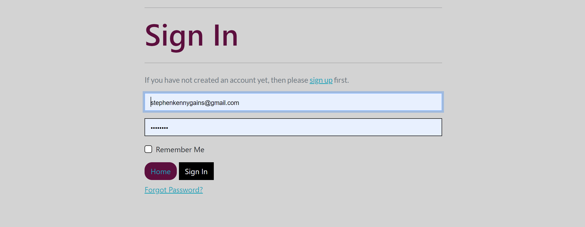

  - The sign in page, just needed enough changes to set the same feel, thrugh colours, fonts and layouts, that it did not feel like you were in any way using a third party or navigatin away from the site whilst you are about to provide personal information.

  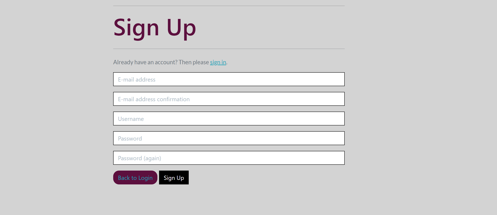

  - For the sign up, the main aim was that the fields be easy to read and easy to understand what was required. Of course having allauth provide the heavy lifting meant all that was required was colour coding and directing successfully to make it a pleasant esperience. 

  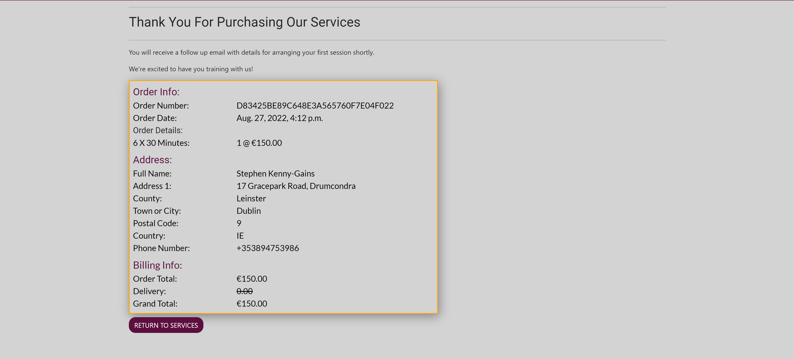

  - For the confirmation receipt, I just wanted to have all the information clearly displayed to the user and have a thankful message diplayed to them. Ensuring that mobile, tablet and desktop views all gave a similar experience was important and so I compared recipts of other sites to mobile versions too and found that they kept a similar style and made users scroll for info instead of minimizing it to have to zoom

  

Please use the Drop down above to expand out the Dekstop Images  

## Colour Scheme 

The colour scheme for the site was based off colours which evoke the emotions typically associated to health and wellnes and physical activity. Colours can be seen to be similar to well know fitness brands like Anytime Fitness, Orange Theory, Fitness First and others. Whilst the colors below were not the original colours planned for the site, while keeping to the colour palettes I reviewed, I wanted to offer a higher contrast for the viewer for the text based sections of the site and so opted to change out the Dark tone grey colours for the background paired with the yellow tone font colour and lighten it to use a higher contrasting black or white font colour where the higher contrast would make sections both stand out and be easier on the eye for the user.

- #5C0F3E
- #FFA500
- #D3D3D3
- #000
- #fff

## Font Choice

I chose Roboto and Lato as they are two of the most popular fonts currently used and having familiarity in the site can help build a sense of trust in the user. I had experimented with other fonts but found that the two complimented each other well and given that there is not a great deal of text through the site, the fonts felt easy on the eye to avoid any strain for the user.
While the fonts can be considered to be more generic than others and also do not fit the standard font used across other well know fitness sites, I do not have the design capabilities to develop custom imagery and logos that will help to match those used in other Fitness sites globally. Given a higher reach and potential increase in time and budget for design, I would look in to choosing a more dynamic font but without that, the two fonts chosen give the desired look and feel for the services provided. 

## Favicon 
The favicon was created on https://favicon.io/ and was used with Header and Footer colour with a contrasting white background. To upload this, it first needed to be added to the AWS S3 bucket under the media files and then linked in the Head element of the base.html file. 

# Additional Future Features
The following features may prove useful to the site with a larger audience and further market research

- A blog of content related to health and wellness so the newsletter can direct traffic back to the site

- With additional services potentially being brought in the future, additonal partitioning of the services through available categories in the navigation will make for easier use for the user but with a small group of categoreis to choose from, having the user navigate through the options shows the user what is available and make it look like a larger operation.

- At present, users can buy multiple packages of personal training which makes sense for the 6 and 10 session pacages as a user may want 12 or 20 sessions in a package but if any noticeable errors came through in orders, limiting users to 1 service of each type per purchase may be a required feature. 

# Technologies Used

- HTML
- CSS
- Python
- JavaScript
- GitHub
- GitPod
- Herokuutilised/tested. 
- Django
- Bulma
- Bootstrapresponsive across multiple devices and screen sizes.
- Font Awesome
- Adobe XD
- Lucid Chart
- Google Fonts

# User Testing
## **Manual Testing based on User Stories**
### Admin
As an admin I would like to be able to review recent purchases
(Recent purchases send through to the admin panel as expected with necessary details)
As an admin I would like to be able to add to the list of services available
(Services can easily and successfully be added to the site throuh the Services Management page)
As an admin I would like to be able to update and/or delete services as necessary
(Services can easily and effectively be edited or deleted when viewing on the Services page)
As an admin I would like to be able to see new users that have been created for the store
(New users are successfully added to the database and can be viewed in the admin panel for review)

### **Shopper**
As a User I would like to be able to find services on the page easily and quickly
(Tested and worked as designed and felt the process simple and easy and no errors on multiple test)
As a User I would like to be able to find services on the page easily and quickly
(Navigation bar worked as Designed and was easily accessbible on various devices. No failed attempts)
As a User I would like to be able to add services to my cart for review before purchasing
(Cart was successfully updated with products and view was rendering as easily readabale and understandable)
As a User I would like to be able to clearly be able to see the services I am purchasing and price
(List of services displayed as expected both in the cart and checkout pages of the app and were easily recognised)
As a User I would like to be able to browse the site easily with no unnecessary clutter
(Site was kepy minimal and from additional user testing, were able to navigate through the serives easily and understand site objective)
As a User I would like to be able to I would like to be able to store my information for the future
(Information saved to user profiles when saving through the checkout page and by adding through the profile section)
As a User I would like to be able to review my details and payment before completing my purchase
(Checkout page is easily read through form fields to be able to understand and read the details provided along with validating checks)
As a User I would like to be able to receive confirmation of my purchase
(Confirmation email and receipts successfully sent with correct details after completing payment)
As a User I would like to be able to Opt in for further information from the business
(Mail chimp form is successfully adding users to the Mailchimp contacts for further updates)
As a User I would like to be able to review my previous purchases from the Store
(Previous purchases are displaying in the profile section for the user and displaying correct values)
As a User I would like to be able to understand the services I am purchasing and their pricing
(Pricing page and descriptions of services allow users information on the services they are purchasing and the reasons behind it)
As a User I would like to be able to checkout securely and safely
(Stripe payment is successfully validating cards and asking for verification when required)

# Validator Testing

- The HTML templates were validated using [W3 Validator](https://validator.w3.org/nu/#textarea). No major errors were returned for the HTML segments.
- The CSS style sheet was validated using [W3C Validator](https://jigsaw.w3.org/css-validator/#validate_by_input) and no errors were returned.
- The JavaScript files were run through [JSHint](https://jshint.com/) and one error was returned for a mising semi-colon.
- The code was validated using [PEP8](http://pep8online.com/). Some Line too long errors were returned but in the interest of time, I did not change all of these.

# Responsive Testing

Responsive Testing was done mainly through Developer Tools for the following as I could only test on Devices for Iphone 12, 8 and on Desktop Sizes.

- iPhone 12
- iPhone 6/7/8
- Samsung Galaxy S20 Ultra
- Samsung Galaxy S8+
- Pixel 5
- iPad Air
- IPad Mini
- 4k 27" Screens
- 1080p 24" Screens
- 1080p 18" Screens

# Known Bugs

- There was an initial issue found where toasts would not display through the JS that was used and was cause by a version mismatch between the Jqeury version and the code written. This was fixed but also removed anyway in favour of messages for display reasons. The toasts felt like they took a lot of screen real estate on mobile devices and with the full view in adding a service, the cart changing colour along with a success message felt like a better UX.

- Ordering of Services based on the category was not as desired so an update needed to be made to the dictionary run through in the services views.py file to have them ordered based on id. This can easily be updated as required with the introduction of new services or categories. 

- During deployment, multiple json dumps needed to be made in order to have all data transferred from local to published site. Opted to keep the files in the file director based on Mentor Advice in case reuqired in the future.

- Images of different sizes were diaplying differently on all screen sizes so css was added to limit the image size to a set height. 

# User Feedback 

- Buttons were taking up a high amount of space on smaller screens and so the buttons throughout the site were made smaller to align better with the rest of the content.

- The toasts section displaying the cart felt redundant as users felt it was possible, but unlikely to add more than one Personal Training service at a time to the cart and so, made the decision to switch to messages to provide User Feedback. 

- The footer was attracting as much attenton as the main content on more minimally styled pages so I opted to keep the footer localized to the Hme page.

- The description of the servce being displayed on the checkout and service pages was taking up a high amount of space and was also congesting the page so was limited to just te service detail page. 

- The size of the order confirmation was made quite large and users felt that it was actually making it harder to read through and align the context to the details and so was reduced back down along with adding some slight contrast changes between sections. 

 
# Search Engine Optimisation
To find the relevant keywords for my project I made the following searches on [Google](www.google.com) and [Word Tracker](www.wordtracker.com) and chose the following list of Key words;

- Fitness
- Training
- Exercice
- Health
- Wellness
- Routine
- Personal
- Nutrition
- Coaching
- Online Coaching
- Personal Training
- Advice

I used these keywords where ever it was acceptable for use wihtout using them without context or relevance. Given the low amount of content currently on the site, I ensured that I used these same keywords in the images I chose for the site. 
 

# Deployment 

This project was deployed using Heroku.

See the following steps to deploy below:

1. Log into Heroku and Create a New App.

2. Give the App a name, it must be unique, and select a region closest to you. 

3. Click on 'Create App'. This will take you to a page where you can deploy your project. 

4. Next, click on the 'Resources' tab and search for 'Heroku Postgres' in the Add-ons section to add the Heroku Postgres database to the project. 

5. Click on the 'Settings' tab at the top of the page. The following steps must be completed before deployment.

6. Within the settings.py file you need to import os and import dj_database_url at the top. Then, in the command line install dj_database_url and psycopg2 along with Gunicorn so that we can use Postgres. Freeze these installs into the requirements.txt file.

7. Scroll down to Config Vars (also known as Environment Variables) and click 'Reveal Config Vars'. Store the database URL in the Config Vars

Using an if statement in settings.py (see below) ,when our app is running in Heroku, we connect to Postgres but in our local environment, we connect to SQLite:

    development = os.environ.get('DEVELOPMENT', False)

    if development:

            DATABASES = {
                'default': {
                    'ENGINE': 'django.db.backends.sqlite3',
                    'NAME': BASE_DIR / 'db.sqlite3',
                }
            }

        else:

            DATABASES = {
                'default': dj_database_url.parse(os.environ.get('DATABASE_URL'))
            }

Development is set in gitpod's environment variables as True.

8. Next I ran the migrations again to set up my Postgres Database by running **Python 3 manage.py migrate** within the command line and then create a Superuser using **python3 manage.py create superuser**.

9. Following setting up the database I generated a new Secret Key, to replace the insecure key that was in settings.py and added: **os.environ.get('SECRET_KEY')**. I then added the newly generated key to the Config Vars on Heroku. 

11. Next, I created a Procfile to tell Heroku to create a web dyno that will run Gunicorn and serve our Django app.

Within this file add the following:

    web: gunicorn friendly-fitness.wsgi

12. I then told Heroku temporarily disable collectstatic by using the Heroku config set, disable collectstatic = 1.

13. Then add the hostname of our Heroku app to 'Allowed Hosts' in settings.py as well as localhost so that GitPod will still work too.

14. Along with these steps, it was also required to do a Json Dump to re uplaod the static and media files to the new database as they were not initially done through a fixtures file. During these steps there were some issues, including Django updating to the latest version which needed to be reversed and through the process, some additional files were created.

15. I opted to keep the files in case they may be required for future testing or development of the site or in the instance of a re deploy. 

16. I then committed and pushed these changes into my GitHub repository so that I could start my first deployment. Once complete, log into Heroku using the following command in the terminal, **heroku login -i**,  and enter your login details.

17. Once logged in, add a remote to your local repository with the Heroku git:remote command and your Heroku app’s name: **heroku git:remote -a clay-and-fire**

18. Finally, deploy using the following command: **git push heroku main**. Once deployed you can open the app from the command line to ensure it was successfully deployed.

- To deploy and host the images and static files through AWS, I followed the videos from the Boutique Ado walkthrough project, along with the updated PDF that was posted to Dev Tips in the slack channel for the 5th Project.

# Credits
## Content 

I used the Code Institutes Boutique Ado Follow Along project to help with building this project along with the following websites:

- [Mini Web Tool](https://miniwebtool.com/django-secret-key-generator/) to generate a new Django Secret Key.
- [Django Documentation](https://docs.djangoproject.com/en/4.1/) to generate a new Django Secret Key.

### Styling
- [Unsplash](https://unsplash.com/)
- [Fonts](https://fonts.google.com/)
- [Font Awesome](https://fontawesome.com/)
- [Bootstrap](https://getbootstrap.com/docs/4.2/)

### Product Images
All media files were used from Unsplash from a variety of artists, which all had images under the titles of 'workout' training' and 'exercise'.
- [Unsplash](https://unsplash.com/)

# Project Requirements 

- At least 3 original custom models with associated functionalities, markedly different from those present in the Boutique Ado walkthrough project if they have been used as a basis for your project.
    - Models were made based on the requirments of the site and for the user.
- At least one form on the front end, which provides either admin or regular users with CRUD functionality without having to access the admin panel.
    - Front end form is present for the Update and Delete function for the admin or edit or remove products.
- At least one UI element on the front end, which allows either admin or regular users to delete records in the database without having to access the admin panel.
    - Available as above
- Evidence of agile methodologies followed during the development of your project in the GitHub repository.
    - Followed through the use of the projects tools in GitHub
- A robots.txt file.
    - Present
- A sitemap.xml file.
    - Present
- Descriptive meta tags in the HTML.
    - Present
- At least one link to an external resource, which makes use of a rel attribute.
    - Included in the Pricing section link to nutrition
- A custom 404 error page.
    - Present
- Evidence of either a real Facebook business page, or mockup of one, for the purposes of digital marketing.
    - a Mockup was created as I do not use an social media platforms.
- Evidence of a newsletter signup form for the purposes of digital marketing.
    - Present through Mailchimp
- A description of the e-commerce business model including marketing strategies in the README file.
    - Included above
- DEBUG mode set to False.
    - Present
- Working functionality for users to register and log in and out of the application without issues.
    - Works as designed
- Working E-commerce functionality for users to make purchases within the application.
    - Works as designed
- Detailed testing write ups, beyond results of validation tools.
    - Included in the user stories, testing, and noted bugs. 

# Acknowledgements

Thank you most particularly to the Code Institute Support Reps who work fantastically to help people like me who may struggle more than others. Very much appreciated. And for the instruction in the Boutique Ado walk through project for the way it was presented and tailored.
